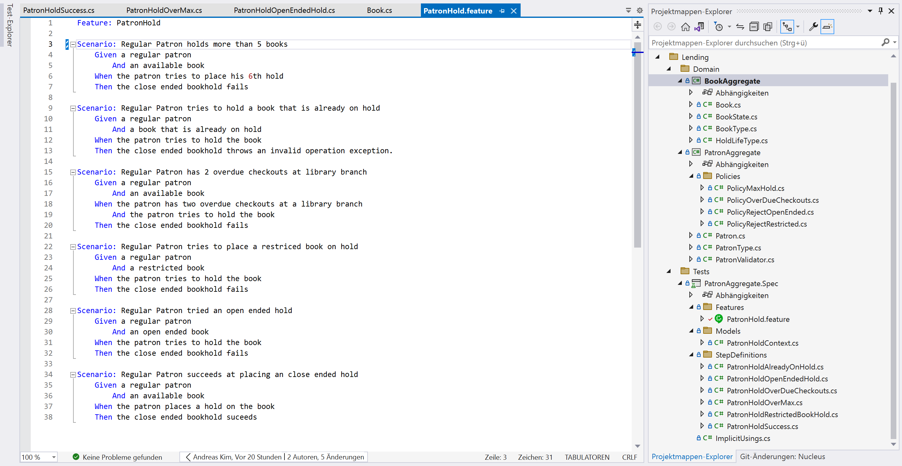
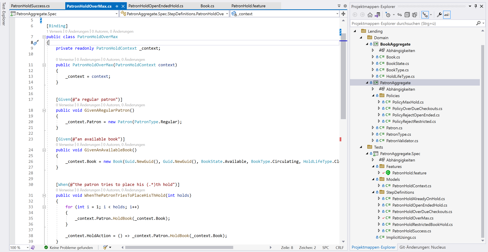

# Design Level Implementation
Since the domain and bounded context are now known, we can shift our attention to the implementation of features identified through the [design level interactions](https://github.com/ddd-by-examples/library/blob/master/docs/design-level.md). The idea is to identitfy relevant features from there and then transfer those to a human readable format close to text, which can then be used to write acceptance tests against. This format in our case is gonna be Gherkin.

## What is Gherkin?
Gherkin is a simple, human-readable language used for writing executable specifications in Behavior-Driven Development (BDD). It serves as a structured format for describing the behavior and expected outcomes of a software system. Gherkin acts as a bridge between business stakeholders, developers, and testers, facilitating effective collaboration and communication.

Gherkin scenarios are structured using the "Given-When-Then" format, also known as the Gherkin keywords. Each scenario typically starts with one or more Given steps, followed by a When step, and concludes with one or more Then steps.

Given: The Given step defines the initial state or preconditions for the scenario. It describes the context in which the scenario takes place.

When: The When step specifies the action or event that is being performed by the user or system.

Then: The Then step describes the expected outcome or behavior of the system after the action specified in the When step has occurred. It defines the expected result or assertion.

## What is BDD?
BDD focuses on defining and automating executable specifications, which are written in a common language easily understandable by all stakeholders involved. It emphasizes collaboration between developers, testers, and business stakeholders. 

We will use BDD to write the acceptance tests according to our features **first** and then implement the functionality.

## Specflow
SpecFlow is a popular open-source BDD framework for.NET that enables the creation and execution of acceptance tests using Gherkin syntax.

In order to use it, first install the SpecFlow Visual Studio Extension. Now you can create a new SpecFlow project in Visual Studio. 

The newly generated project contains a feature file. These files typically have the **.feature** extension.
The feature files serve as living documentation, allowing business stakeholders to review and validate the acceptance criteria, fostering collaboration between stakeholders and the development team.

We can now write our feature files using Gherkin syntax, defining the desired behavior and scenarios for our application:



The beauty of Specflow comes into play, when we right-click on our feature file and choose to "Define Steps". This will let Specflow automatically create test code implementations for each Given/When/Then step of the scenarios:



The steps are reused, meaning that if the gherkin step description is the same, it will refer to the same test code implementation. From the feature view, it is possible to navigate to the code implementation of a step by using F12.
Numbers in a gherkin definition are  automatically replaced and fed into the test code as a parameter. This way it is also possible to refer to more complex data that may be supplied through a table (also defined in gherkin).

We can now fill the test code skeleton with life and implement the actual testing code. For code to be shared within a scenario, I will setup a context class, the PatronHoldContext:

```c#
    public class PatronHoldContext
    {
        public Book Book { get; set; }
        public Patron Patron { get; set; }
        public Action HoldAction { get; set; }
    }
```

This context enables to share information between the different steps in the scenario, so that e.g. the Given step can set a Patron, which will be used in the When/Then steps.

```c#
    public PatronHoldOverMax(PatronHoldContext context)
    {
        _context = context;
    }


    [Given(@"a regular patron")]
    public void GivenARegularPatron()
    {
        _context.Patron = new Patron(PatronType.Regular);
    }

    [Given(@"an available book")]
    public void GivenAnAvailableBook()
    {
        _context.Book = new Book(Guid.NewGuid(), Guid.NewGuid(), BookState.Available, BookType.Circulating, HoldLifeType.CloseEnded);
    }
    

    [When(@"the patron tries to place his (.*)th hold")]
    public void WhenThePatronTriesToPlaceHisThHold(int holds)
    {
        for (int i = 1; i < holds; i++)
        {
            _context.Patron.HoldBook(_context.Book);
        }

        _context.HoldAction = () => _context.Patron.HoldBook(_context.Book);
    }

    [Then(@"the close ended bookhold fails")]
    public void ThenTheCloseEndedBookholdFails()
    {
        _context.HoldAction.Should().Throw<ValidationException>();
    }
```

This context will be automatically injected. It is also possible to implement the driver pattern and have methods solving repetitive task in the injected model.

The implemented tests can be run as usual within Visual Studio and are compatible with different Frameworks like xUnit, nUnit, etc. 
SpecFlow contains a direct integration into Azure, serving as a kind of living documentation. It is directly possible to view each feature and its current test state from a dashboard in Azure. This documentation is also extendable via markdown.